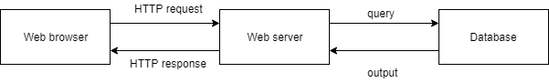

# SQLインジェクション
- Webアプリケーションの大まかな仕組み

- query部分でSQLインジェクションを発生させ、outputでデータを得るイメージ
# 攻撃方法
- 認証回避
- UNIONインジェクション

# 認証回避
- ログイン画面で使う
- `SELECT * FROM user WHERE uid='$uid' AND pwd='$pwd'`: 相手側が提供しているもの
- ここで、入力を`$uid=kaito`, `pwd=' OR 'A'='A`とすると、`SELECT * FROM user WHERE uid='kaito' AND pwd='' OR 'A'='A'`と解釈され、OR以降が真となりログインできることになる。

# UNIONインジェクション
- 商品検索ページで使う
- `SELECT name, price FROM product_table WHERE category='ユーザ入力'`相手側が提供しているもの
- 入力: `' UNION SELECT uid, pw FROM account_table--`とすると、`SELECT name, price FROM product_table WHERE category='' UNION SELECT uid, pw FROM account_table--'`と解釈される。UNION以降がパスとIDのテーブルを表示することになる。