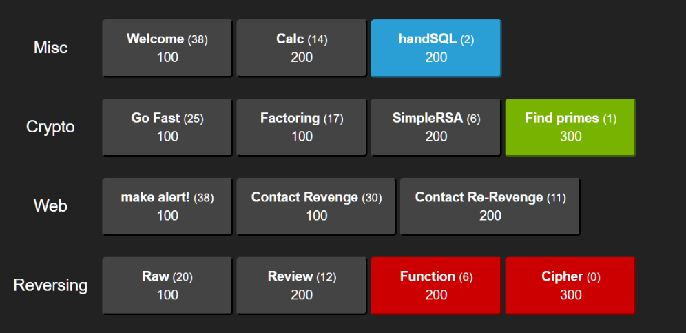
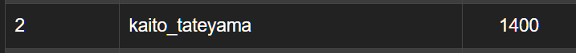

# SECCON Beginners 広島の感想
- なんだか小学生の夏休みの日記的なものが出来上がった
### 参加前
- [2018/08/05] TwitterでmegumishさんやVane11opeさんを見ていて、なんだかCTFっておもしろそうだなと思ったのがきっかけでCTFを始めました。
- [2018/08/07] cpawctfを埋めました
- [2018/8/12] picoctf2017を少ししました
- [2018/8/13] tjctf2018で撃沈したので復習をしました(ここで力が少しつきました)
- [2018/08/21] めぐめぐ会オンラインでmegumishさんにスタックなど、Heap問の前提知識を教えてもらいました(まだpwn周りはよくわからない)
- [2018/9/3] 復習に追われているうちに広島ctf4bに参加

### 当日
- 講義はCrypto, Web, Binaryの3分野でした。[しゅういちさんのブログ](http://ups.hatenablog.jp/entry/2018/09/03/SECCON_Beginners_%E5%BA%83%E5%B3%B6%E8%A1%8C%E3%81%A3%E3%81%A6%E3%81%8D%E3%81%9F), [はすみさんのブログ](http://mwc922-hsm.hatenablog.com/entry/2018/09/01/234729)が詳しいので僕は感想を書きます。
- Cryptoに関してはRSAを予習してきたのでほぼ知っている内容でした。ただ、乱数生成器の不備によって数学的に脆弱になる可能性など、ちょこちょこ知らない話が出てきてひゃー嬉しい！暗号楽しい！となっていました。家に帰って、講師の方が所属するチームdodododoを検索してその業績にびっくりしました。広島にあんなやばい人間が来ていたのか…貴重な機会だったんだなあ。
- Webに関してはどういう形で攻撃が成立するのか？という視点で講義が進みました。個人的に、それまでXSSといえばアラート出して嬉しい！あれ、何が嬉しいんだろう？？？と思っていました。XSSが可能ならばリンクを攻撃対象に踏ませることで偽のHTMLを表示させて情報を抜き取り、攻撃者側にHTMLやCookieを送ることで攻撃が成立する、という話を聞き、攻撃が成立するまでの流れが理解できました。
- Binaryに関しては、資料配布時点で見るからに枚数がごつくて、怯えながら受けていました。しかし、講師の方のスピードがちょうどいいテンポで、演習が挟まれていて理解が進みやすく、本当にこれは最高でした。一人でRevとかやってるとつまづきしか感じなくてモチベーションが下がるのですが、これはステップアップしていく気分が本当によくて、Revへの意欲が湧きました。バイナリ、読めると楽しいですね。radare2が紹介されなかったのが少し寂しい。

#### CTF演習
##### 前置き
- CTF演習が最後にありました。最終的に2位になることができて嬉しかったです。
- 環境: windows, ubuntu16.04(仮想環境)を使いました。

- 1位: 1700点
- 2位: 1400点
- 3位: 1200点
- 4位: 1200点
- 5位: 1100点
- 6位: 1100点
- 7位: 1000点
- 8位: 1000点
- 9位: 1000点
- 10位: 900点
- と、かなりぎりぎりでの2位だったのでもっと精進を積まねばという気持ちです。

##### WriteUp
- [Misc]
- Welcome(100): CTFによくある、最初の軽い確認問題ですね。コピペをしました。
- Calc(200): `a+b*c`や`a-b*c`や`a*b+c`といった形の簡単な計算問題を100回解くというものです。真っ先に[てけいさんえくすとりーむず](https://graneed.hatenablog.com/entry/2018/05/27/173354)を思い浮かべますが、コードかき捨てができない。100回手動で計算しました。紙をたくさん使った…想定解はPythonで、Beautiful Soup + Requestっぽいです。スクレイピングに思い至らなかったです。
- handSQL(200, WA): 解けませんでした。SQLiじゃん！と思っていたのですがことごとくはじかれて何をすればいいのかもわからなかった。想定解は何回か正しいSQL文を送ればよいというもので、そもそもSQLiではないですね。ちゃんと問題を読みましょう…
- [Crypto]
- Go Fast(100)かFactoring(100)←どちらか片方を忘れています。: 素数二つの積`pq`が与えられるので、素因数分解して`p+q`の値を求めよう！という問題。競技プログラミングで鍛えたC++で瞬殺！と思ってコードを書き始めたときにふと、「…これ、Wolfram Alphaでいけるのでは」と思って[Wolfram Alpha](http://www.wolframalpha.com/)に投げたら普通に素因数分解されてしまった。和をとって終わり。
- SimpleRSA(200): `p,q,e,C`が分かっていて`M`が知りたい状態なので`d`を求めればOK。`phi = (p-1)*(q-1)`として、`mod phi`での`e`の逆元を拡張ユークリッドを用いて求めます。出てくる数値を`binascii.a2b_hex`で変換して、`ctf4b{rsa_is_very_simple}`を得る。
- Find Primes(300, 未AC): ソースコードを見て、あ、これは片方で使いまわしが起きてるからそこからなんとかするやつやなと思って結局手を付けられませんでした。想定解は、素数の使いまわしが起きているためgcdが1ではなくなるところが存在していて、それを見つけ出すことがカギだったようです。
- [Web]
- make alert!(100): XSSでアラートを出す。``
- Contact Revenge(100): XSS。``でURLをreqestbinにして、自分に情報を送信させると、その中にflagがある。
- Contact Re-Revenge(200): 前問と同じようにすると`script`が許可されていないことがわかる。個人的なアレですが、こういうjailっぽい感じの、監視の目をかいくぐる問題(pyjailなど)が解けないけれど、大好きです。少しXSSチートシートなどを調べて``みたいな大文字を混ぜるやつを試すとうまくいきました。とまとさんは`img`タグに仕込む形でリンクを踏ませていたので、複数解法があるのだと思います。
- [Reversing]
- Raw(100): stringsコマンドで見れるらしい。僕はradare2でたどっていって文字列を発見しました。
- Review(200): Binary演習のような問題が出されて、それにこたえていくとflagが手に入る。基本的に`nop`で囲まれた中を見ていけばOK。
- Function(200, WA): 最後までこれを粘っていました。どうやら普通にASCIIをくっつければよかったらしく、とても悔しい。
- Cipher(300, 未AC): これはバイナリを持っていないので分かりません。XORをかけるなど、少し複雑な処理を追いかける必要があったそうです。

#### 最後に
- 広島で開催してくださって本当にありがとうございます！！！地方では人と話したり、演習で競い合ったりという経験自体が稀なのでほんとうにありがたいです。また開催してほしいです。
- とまとさん、しゅういちさんと問題の解法などの話ができて楽しかったです！はいひるさんとなんばつさんといろいろお話してみたかったです。また会える機会があればいいなあと思っています。