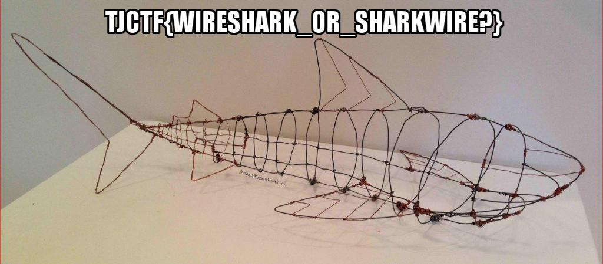

# Ssleepy [Forensics]
```
I found this super suspicious transmission lying around on the floor. What could be in it?
```
- it.pcapngはコピーしたやつ

# 解説見た
- pcapngをwiresharkで見る→右クリック > Follow > TCP Stream
```
220 Welcome to my super-secure, private-key-transmitting, FTP server
USER user
331 Please specify the password.
PASS password
230 Login successful.
TYPE A
200 Switching to ASCII mode.
PASV
227 Entering Passive Mode (104,155,183,43,167,178).
LIST
150 Here comes the directory listing.
226 Directory send OK.
CWD files
250 Directory successfully changed.
TYPE A
200 Switching to ASCII mode.
PASV
227 Entering Passive Mode (104,155,183,43,172,104).
LIST
150 Here comes the directory listing.
226 Directory send OK.
CWD private
250 Directory successfully changed.
TYPE I
200 Switching to Binary mode.
PASV
227 Entering Passive Mode (104,155,183,43,163,190).
RETR key.zip
150 Opening BINARY mode data connection for key.zip (924 bytes).
226 Transfer complete.
QUIT
221 Goodbye.
```
- key.zipが怪しい
- `ip contains key`でサーチ
- 3つめの実際にFTPdataというとこをFollow Stream
```
PK...........L.Z......w...(...../user/ftp/files/private/server_key.pemUT	...	Z[.	Z[ux.............m....H.Ds.bs...A....N .0.NH0x'.....:...^..... ....?..sGO..?...[...Bb.".BC(]I.EY{.~y35..m.q.~..&W.8t...v D
^..y[%G....q%G.`..M..g6KG
:E....JQ.[...Yi.^e........~...p..^.qeX@..{R..f&.e.>..y\F:.W.Y..2A1..+..........v....im...f9N...	[z.M.?L.Z.Y..Z.=.zq/IB.....c.4..]=0...r.d...u....le..'..&.d.k.s.>....@.RG.4..z.....Q.........,..>L
...\[..8..JhI.Wa.a-C.u..j......{Z+...n.v.$..{S........R.V].......&...)~k.h18,.8].h.......)2..n..._m..g|..K7...;.)M.......B..f.-B....#r.H..;7/.U.#..}.8..lJt].7.n...<_.....|..c.">..E.Xd.i.../..u..z...5.d..I.-.._.9.e^........x.>.^.N..!K.p/....>..)...
........AE	...a.....F..@S.B..`..z............T..uz....c..;6...........-y4..Xe.Sg..O.....U..(	b...w.d.....x....O...._...PK.............L.Z......w...(.................../user/ftp/files/private/server_key.pemUT....	Z[ux.............PK..........n.........
```
- これがファイルの中身っぽい
- PKファイルとヘッダからわかる
- 中身をsave as key.zipする
- `file key.zip` -> `key.zip: Zip archive data, at least v2.0 to extract`
- 解凍 -> server_key.pem
- keyを使ってSSLを読み解く
- Edit > Preferences > SSL > Edit
- 10.142.0.3/443/http/key_pemの場所をそれぞれ埋める
- it.pcapngではないものを見ていた…
- key_pemを登録してもう一度見る
- 解読できる。Client　Helloを見る
```
GET /index.html HTTP/1.1
Host: 104.155.183.43
Accept-Encoding: gzip, deflate, compress
Accept: */*
User-Agent: python-requests/2.2.1 CPython/2.7.6 Linux/4.4.0-130-generic

HTTP/1.0 200 ok
Content-type: text/html

<!DOCTYPE html>
<html>
<head>
<meta charset=utf-8 />
<title>Sharkwire or Wireshark?</title>
<style>
.center {
    display: block;
    margin-left: auto;
    margin-right: auto;
    width: 50%;
}
</style>
</head>
<body>

</body>
</html>

```
- flag.jpgがほしいね。
- GET /flag.jpgをFollow Stream SSL
- Export ASCII flag.jpg
- そのままでは見れない(前の方に余分なものがくっついている)
- vim -b flag.jpg
- 前の方を削除(jpgはffd8から開始する)
- flag.jpgを見る
- `TJCTF{WIRESHRAK_OR_SHARKWIRE?}` ->なんか間違うんだけど、他のサイトだとこれが正解ということになってるしいいかな…
